# Write-up Midterm Project:

## Find 10 examples of vehicles with varying degrees of visibility in the point-cloud.

Example 0:

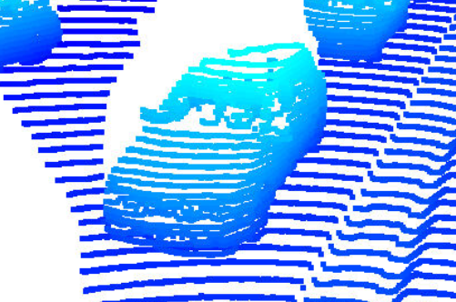

Example 1:

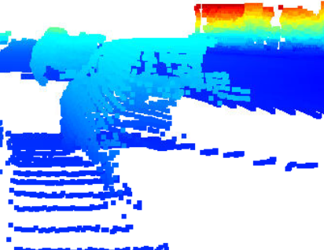

Example 2:

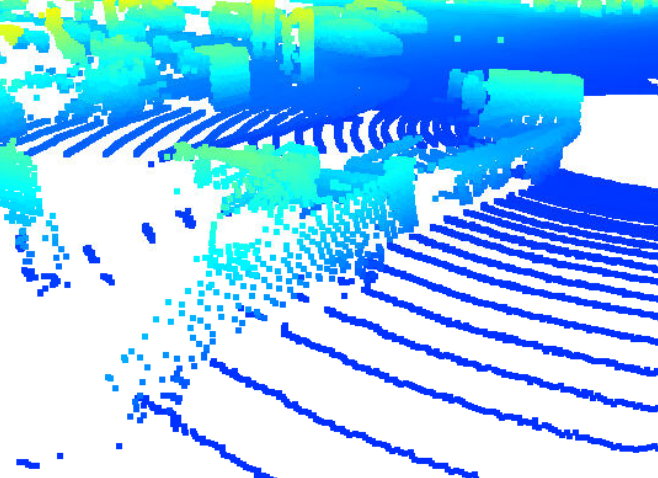

Example 3:

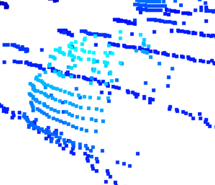

Example 4:

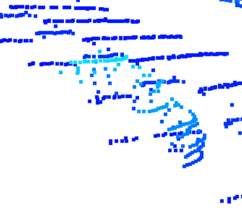

Example 5:

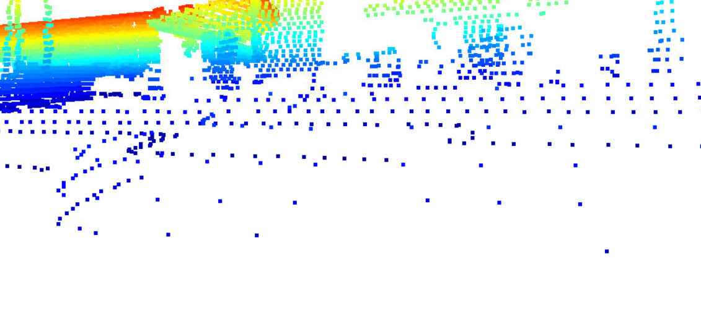

Example 6:

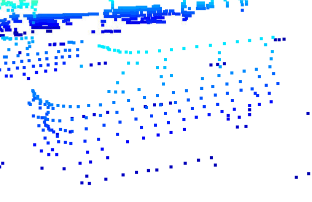

Example 7:

Example 8:

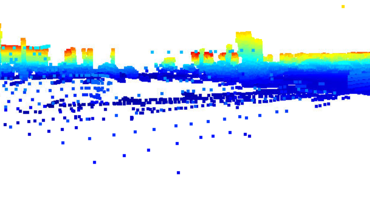

Example 9:

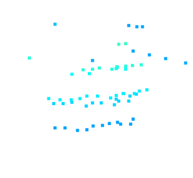

## Car Features:

The dimensions of car objects are different from other objects, from the bev view it can be seen the real dimensions of cars from a top-down view.

Tail-Lights have a high intensity reflection within range image and could be used for detection.

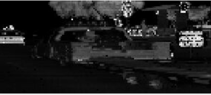

Rear or Front Bumper can be used for detection, since it is the most visible part of the car.

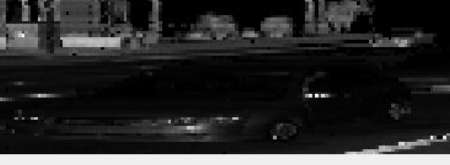

Car's side mirror have a specular reflection that can be used for detection.

